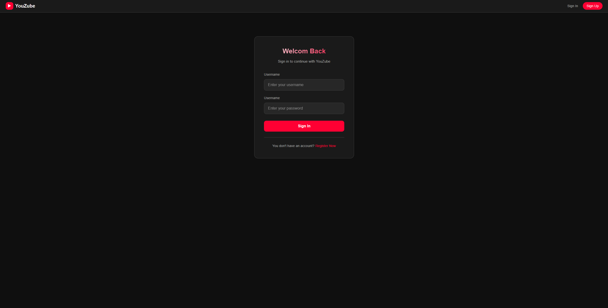
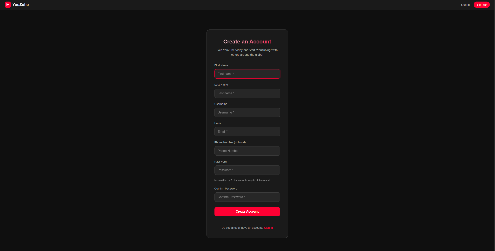
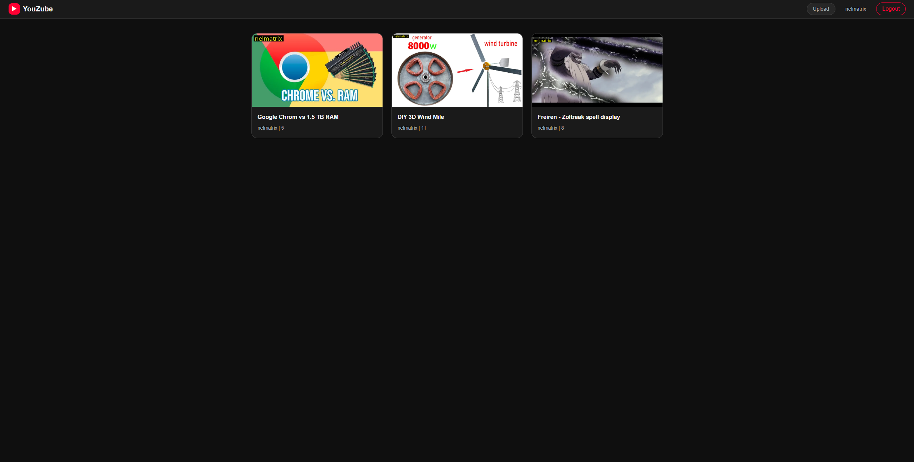
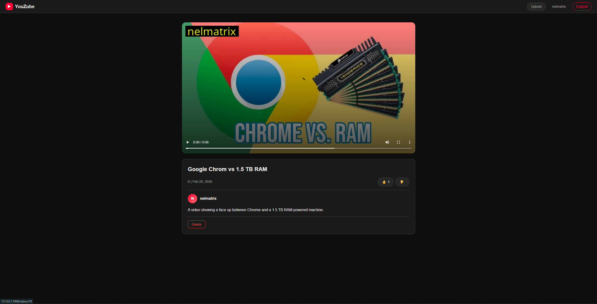
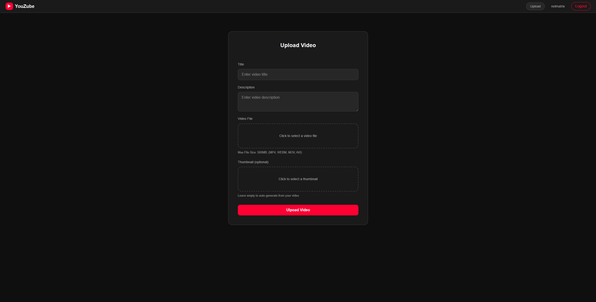
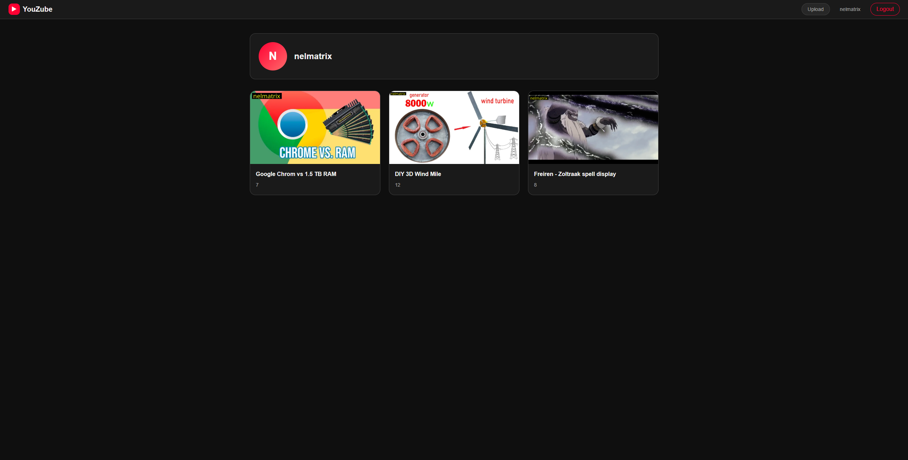
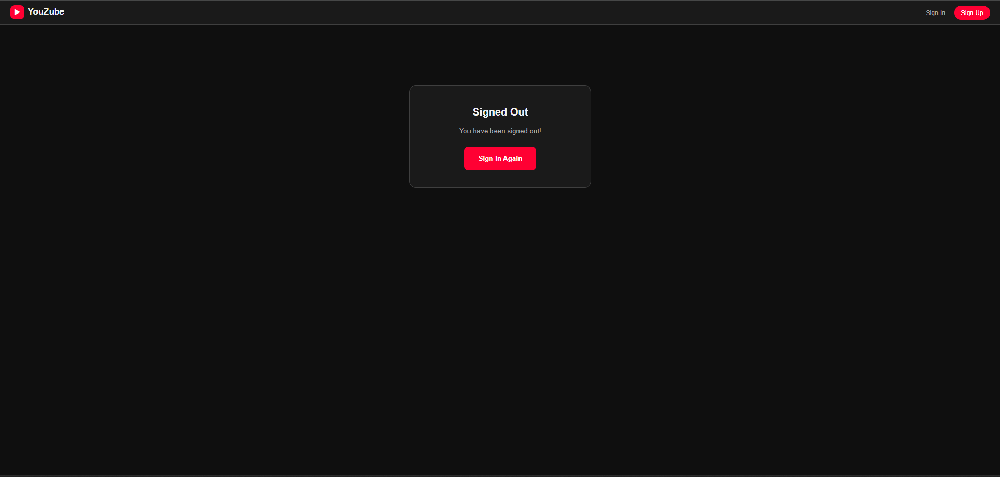

# YOUZUBE

YouZube is a clone of the Youtube application, built using the Django framework, and it utilises Imagekit IO for media storage and streaming. This project was built as part of my introduction to the Django framework, and my training as a fullstack developer using Python as my primary language.

---
  

  

  

  

  

  

  

---
MIT LICENSE  

---